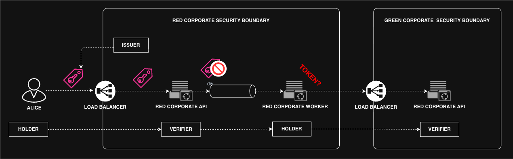
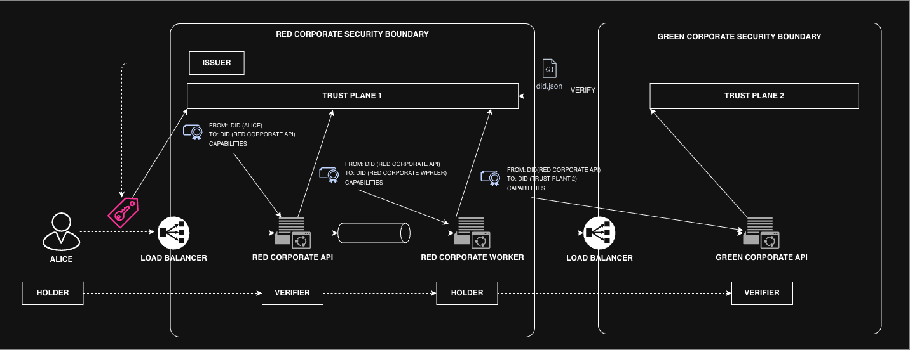
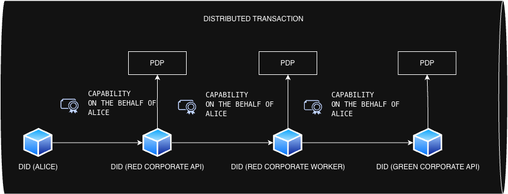
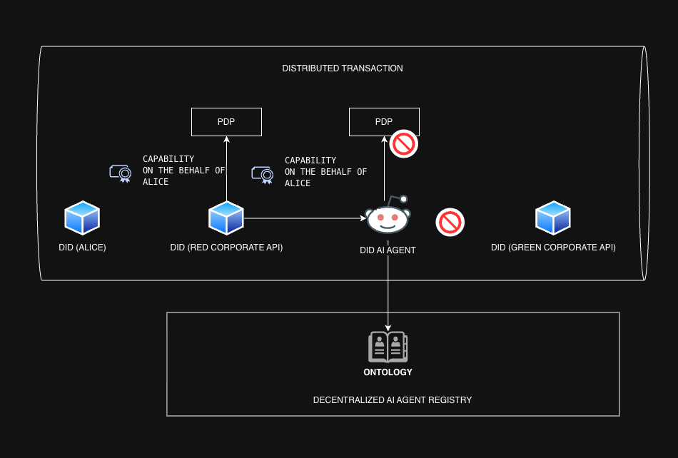

# DID-based Trust Chains for Workloads and Agents

This document is explains concepts related to the proposal in [DIF Work Item Proposal (Draft)](2025-11-24-dif-work-item-proposal.md) and is intended to illustrate the core idea of using DID-based trust chains for workloads and agents.

## Paradigm Shift for Authorization in Distributed Transactions

The current approach aims to define a robust authorization flow that supports workloads and AI Agents.  
This work enables an alternative authorization primitive for distributed environments.

**Current Paradigm:**  
> **Tell me who you are — and what you were allowed, requested, or delegated to perform at the moment we minted a bearer token embedding that snapshot of authorization.**

**New Paradigm:**  
> **Show how you got here**
>
Capability continuity is derived from the verified transaction context and participant provenance.  
Governance and risk adjustments MAY be applied within the distributed transaction itself.  
A terminated transaction MUST invalidate all delegated capabilities associated with it.

This shift is grounded in the model of distributed transactions.  
We must design a model capable of supporting distributed transactions at scale and establishing a consistent security model that applies across the public internet and enterprise/internal environments.

In distributed transactions, **asynchronous flows are the norm**, not the exception.  
Messaging systems, event brokers, and streaming transports dominate real workloads.

Workloads and AI Agents are **first-class participants in distributed transactions**.  
The paradigm is based on a core assumption:

1. **Distributed transactions MUST continue to operate across asynchronous boundaries, including message flows where bearer tokens dissolve.**

2. **Transaction rails MUST enable a consistent security model applicable to both public internet and private/enterprise environments.**

3. **A capability token MUST NOT be treated as valid outside the distributed transaction that delegated it.**

> **NOTE:** OAuth, OIDC, SAML and bearer flows aren’t rejected — they simply become a subset of the broader model.

### Example: Delegated Capability

> You do not need to know the driver’s identity to start the engine.  
> You only need proof of delegated capability.

A **car key** represents a **capability token**:  
it enables the holder to perform a specific action without embedding personal identity.

In a distributed transaction model, a capability token is **valid only for the transaction in which it was delegated** (the authorized trip).  
Outside that transaction scope, the token is **inert**.

## Building the Superset Security Model

Reasoning from trivial cases is meaningless.  
Synchronous handoffs (in-memory, single hop, no queues) always validate the legacy model.  
They do not test its limits and therefore cannot demonstrate a superset.

To prove a superset, we must start from the **principal case**:  
the environment where distributed transactions actually operate — **asynchronous messaging**.

Only in asynchronous flows do the fundamental constraints emerge:

- **Identity continuity MUST be cryptographically preserved through provable delegation. Replacing the Subject identity at any hop creates a new principal and MUST be treated as an attack surface.**
- **Bearer tokens cannot preserve holder-authenticity or capability-context across asynchronous boundaries.**  
- **Minting replacements violates subject integrity.**  
- **Capability must be delegated, not replayed.**

The async boundary is not an edge case —  it is the **proof** that the entire snapshot-based model is a subset.

### The Fundamental Constraint

A bearer token **cannot preserve its security semantics or holder binding** across asynchronous boundaries.  
Forwarded as payload, it becomes detached from the holder: signature does not reconstitute holder-binding.  
Therefore, bearer-token identity is a **subset** of the superset model.

### Identity Rules in Distributed Transactions

1. **If you are not the Subject, you MUST NOT mint or issue a token on behalf of the Subject.**  
2. **Distributed transactions operate as: Holder → Verifier → Holder → Verifier.**

In-memory handoffs preserve continuity (a Verifier MAY become the next Holder).  
Asynchronous boundaries do not: the next Holder has no Subject token.  
Minting a new token at this point **violates Rule 1**.

> **Token-based identity continuity CANNOT be preserved across asynchronous boundaries.**  
> Such flows become discontinuous unless the underlying protocol was designed to tolerate token fragmentation.

### Shifting the Model

The Holder does **not** forward the token.  
The Holder delegates capability to the Verifier via an attestation issued by the Trust Plane.

The Verifier MUST prove:

- its own identity continuity, and  
- that the capability was delegated by the previous hop.

We no longer forward the Subject token.  
We forward **proof of delegated capability**.

The delegated Agent (human, machine, or AI) is anchored to its DID.  
Capability metadata is embedded in the trust envelope.

The Agent is not a token holder —  
it is a **verifiable participant in the capability chain**,  
able to act under delegated authority **without credential leakage**.

## The Reference Use Case

The smallest use case that demonstrates the superset model is a **three-hop distributed transaction** crossing a single asynchronous boundary.

### Actors

- **Alice** — Human Subject and initial Holder.  
- **RedCorporate API** — first Verifier.  
- **Kafka Topic** — asynchronous boundary.  
- **RedCorporate Consumer** — second Holder.  
- **GreenCorporate API** — second Verifier.

### Transaction Sequence

1. **Alice authenticates and receives a JWT (capability snapshot).**  
   The JWT binds Alice’s identity to a set of permissions at issuance time.

2. **Alice → RedCorporate API (Holder → Verifier).**  
   Identity continuity is preserved: the Verifier can validate holder-binding.

3. **RedCorporate API emits an event to Kafka (asynchronous boundary).**  
   **At this boundary, holder-binding cannot be preserved.**  
   The token or claims lose their semantic link to the actor who presented them.

   **To place the token into a message, the API must either:**
   - **strip its transport signature**, turning it into plain payload, or  
   - **encrypt/encapsulate it**, turning it into a sealed blob.

   **Neither option preserves holder-binding.**
   - Removing the signature removes the guarantee that the token is bound to the original holder.  
   - Encrypting or encapsulating the token only protects confidentiality and integrity of the data, not *who currently possesses the right to exercise it*.

   Once inside the broker, the message becomes generic payload:
   **any eligible consumer can retrieve it, regardless of the original Subject.**

   **At this point, the consumer must present a new identity to continue the transaction** —  
   whether that identity is a Service Account, a SPIFFE/SVID workload identity, or any other local principal.  
   This is a *new subject*, not a continuation of the original holder-binding.  
   The system has introduced a new principal into the transaction without provenance.

   **This does not preserve identity continuity — it replaces it.**  
   The Consumer is now acting on its own behalf, not on behalf of the original Subject.  
   Token replay, token minting, or workload-generated credentials at this stage are all forms of subject substitution and introduce new attack surfaces.

### Why This Use Case Proves the Superset

- **Bearer semantics collapse at the asynchronous boundary.**  
- **No mechanism exists to preserve holder-binding across message brokers.**  
- **Replay or re-minting introduces a new principal and a new attack surface.**

This is the minimal configuration that invalidates snapshot-based identity models.  
Synchronous handoffs remain a trivial subset; distributed flows expose the real constraint.

## DID-based Trust Chains

Using the DID-based trust chain model ( [DIF Work Item Proposal Draft](2025-11-24-dif-work-item-proposal.md)), identity continuity is preserved
because capability is always delegated from a cryptographic principal
(From DID) to another cryptographic principal (To DID), not replayed.

At each hop, the node MUST validate the incoming capability against its
local policy engine (PDP):

- The peer identity (From DID) MUST be authenticated.
- The peer MUST have been explicitly delegated a capability to act
  in the scope of the transaction.
- The receiving identity (To DID) MAY elevate only within its own
  authorization boundaries.
- Capability MUST be contextual to the transaction and MUST NOT be
  transferable beyond it.

This evaluation replaces token forwarding.
No identity artifacts are transported; only verifiable delegation is.

> **NOTE:** Trust Plane trust assumptions are equivalent to those of a conventional Authorization Server.  
> The distinction lies in the artifact it produces.  
> Traditional Authorization Servers issue bearer-based authorization snapshots.  
> A Trust Plane issues provenance-linked capability delegations that extend identity continuity across distributed transactions.

## DID BASED TRANSACTION FLOW

At this stage, the distributed transaction preserves continuity of identity across hops.

Each hop operates under a verifiable capability delegated **on behalf of the Alice DID**, rather than replaying or reminting an authorization artifact.

The transaction remains a distributed execution flow.

## TRUSTED AI AGENTS

Let us now assume that the entity previously referred to as the “Red Corporate Worker” is replaced by an **AI Agent**.

During the Trusted AI Agent working session, Alan Karp articulated the core requirement for a Trusted AI Agent:

> **The possession of a valid token/capability is not sufficient.  
> Authorization must depend on whether the Agent is trusted for the specific task/risk model.  
> If the capability involves payment, and the Agent is not trusted for financial operations,  
> the authorization MUST be denied even if the Agent presents a token/capability.**

This requirement illustrates why token-based authorization is insufficient in distributed systems.

### DID-Anchored AI Agents

Assume the AI Agent has its own DID.  
Its DID is registered in a decentralized DID Trust Registry.

> **NOTE:** The [Trusted AI Agents Working Group (WG) Components]  
> (https://github.com/decentralized-identity/trusted-ai-agents/blob/main/work_items/use_cases/use-case-clusters-components.md)  
> define how trust properties, identity, and capabilities are represented.

The AI Agent can present a **Verifiable Presentation** containing ontology about:

- its trust level,
- its capability set,
- its provenance,
- risk score,
- its safety constraints or operational boundaries.

### Where the DID-Based Trust Chain Governs

At this point, the DID-based Trust Chain becomes decisive:

> **Authorization is not driven by the existence of a capability,  
> but by whether the capability is *trusted in context*.**

If Alice’s policy states:

- **“This Agent MAY NOT exercise payment capabilities.”**  
  The transaction MUST be terminated immediately.  
  The presented capability is **not valid in this context**,  
  and the Verifier MUST reject it, even if it is cryptographically correct.

There is no ambiguity:

- Capability is contextual.  
- Trust is task-specific.  
- Authorization is a decision of governance, not permission replay.

The transaction MUST terminate if trust conditions are not satisfied.

## Appendix

- **Transaction rails:** the transport and boundary surfaces that carry distributed execution (e.g., APIs, queues, brokers, message buses).
